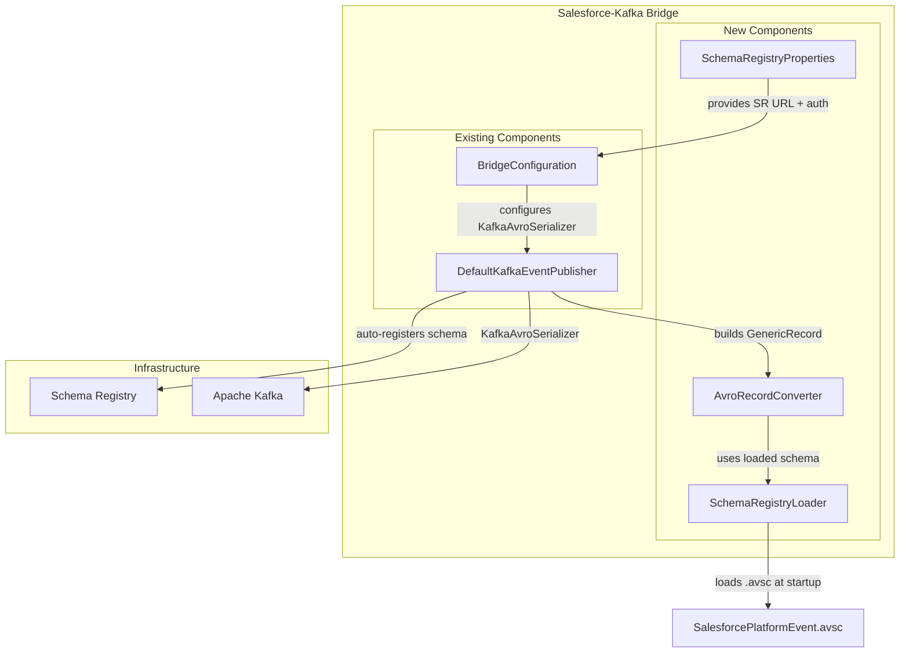
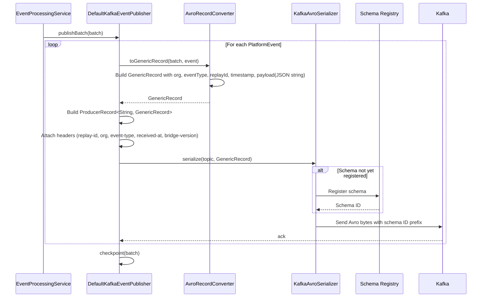

# Design Document: Confluent Schema Registry Integration

## Overview

This feature integrates Confluent Schema Registry into the existing Salesforce-Kafka Bridge to replace raw JSON byte array serialization with Avro-encoded messages. The bridge currently uses `ByteArraySerializer` with Jackson `ObjectMapper` to serialize `PlatformEvent` payloads. This design introduces a generic Avro envelope schema (`SalesforcePlatformEvent`) that wraps dynamic Salesforce event payloads as JSON strings inside a fixed Avro record structure.

The envelope approach is chosen because Salesforce Platform Events have dynamic, per-event-type schemas that are not known at compile time. Rather than generating per-event-type Avro schemas (which would require schema management for every Salesforce event type), a single envelope schema captures the metadata (org, eventType, replayId, timestamp) as typed Avro fields and carries the original JSON payload as a string field. This gives us schema evolution and compatibility enforcement on the envelope structure while preserving the flexibility of dynamic payloads.

Key design decisions:
- Single envelope Avro schema rather than per-event-type schemas (simplicity, dynamic Salesforce schemas)
- `KafkaAvroSerializer` for value serialization, `StringSerializer` retained for keys
- Schema auto-registration enabled on the producer side
- Consumer configuration provided for downstream services using `KafkaAvroDeserializer`
- Local Schema Registry in docker-compose for development parity
- Confluent Cloud basic auth support for staging/production

## Architecture

### Integration Points



### Serialization Flow



## Components and Interfaces

### AvroRecordConverter

Converts `PlatformEvent` and `EventBatch` metadata into Avro `GenericRecord` instances conforming to the `SalesforcePlatformEvent` schema.

**Responsibilities:**
- Hold the parsed Avro schema loaded at startup
- Convert PlatformEvent + batch metadata into a GenericRecord
- Serialize the JSON payload to a string using Jackson ObjectMapper
- Convert the replay ID byte array to an Avro `ByteBuffer`

**Interface:**
```java
@Component
public class AvroRecordConverter {

    private final Schema schema;
    private final ObjectMapper objectMapper;

    public AvroRecordConverter(Schema schema, ObjectMapper objectMapper) {
        this.schema = schema;
        this.objectMapper = objectMapper;
    }

    /**
     * Converts a PlatformEvent and its batch context into an Avro GenericRecord.
     *
     * @param batch the event batch providing org and receivedAt
     * @param event the individual platform event
     * @return GenericRecord conforming to SalesforcePlatformEvent schema
     */
    public GenericRecord toGenericRecord(EventBatch batch, PlatformEvent event) {
        GenericRecord record = new GenericData.Record(schema);
        record.put("org", batch.getOrg());
        record.put("eventType", event.getEventType());
        record.put("replayId", ByteBuffer.wrap(event.getReplayId().getValue()));
        record.put("timestamp", batch.getReceivedAt().toString());
        record.put("payload", objectMapper.writeValueAsString(event.getPayload()));
        return record;
    }
}
```

### SchemaRegistryLoader

Loads the Avro schema from the `.avsc` resource file at application startup and exposes it as a Spring bean.

**Interface:**
```java
@Configuration
public class SchemaRegistryLoader {

    /**
     * Loads the SalesforcePlatformEvent Avro schema from classpath.
     * Fails fast with a descriptive error if the schema file is missing or malformed.
     */
    @Bean
    public Schema salesforcePlatformEventSchema() {
        try {
            InputStream schemaStream = getClass().getResourceAsStream(
                "/avro/SalesforcePlatformEvent.avsc");
            if (schemaStream == null) {
                throw new IllegalStateException(
                    "Avro schema file not found: /avro/SalesforcePlatformEvent.avsc");
            }
            return new Schema.Parser().parse(schemaStream);
        } catch (IOException e) {
            throw new IllegalStateException(
                "Failed to parse Avro schema: /avro/SalesforcePlatformEvent.avsc", e);
        }
    }
}
```

### SchemaRegistryProperties

Configuration properties for Schema Registry connection and authentication.

**Interface:**
```java
@ConfigurationProperties(prefix = "schema-registry")
public class SchemaRegistryProperties {
    private String url;
    private String authSource;
    private String userInfo;
    private String compatibilityLevel;
    
    // getters and setters
}
```

### Modified DefaultKafkaEventPublisher

The existing `DefaultKafkaEventPublisher` is modified to:
1. Accept `KafkaTemplate<String, GenericRecord>` instead of `KafkaTemplate<String, byte[]>`
2. Use `AvroRecordConverter` to build GenericRecord values instead of `objectMapper.writeValueAsBytes()`
3. All header logic and composite key logic remain unchanged

**Key changes in `publishEvent`:**
```java
// BEFORE:
byte[] payload = objectMapper.writeValueAsBytes(event.getPayload());
ProducerRecord<String, byte[]> record = new ProducerRecord<>(kafkaTopic, null, key, payload, headers);

// AFTER:
GenericRecord avroRecord = avroRecordConverter.toGenericRecord(batch, event);
ProducerRecord<String, GenericRecord> record = new ProducerRecord<>(kafkaTopic, null, key, avroRecord, headers);
```

### Modified BridgeConfiguration

The Kafka producer configuration changes from `ByteArraySerializer` to `KafkaAvroSerializer` for the value serializer. Schema Registry properties are injected into the producer config.

```java
@Bean
public ProducerFactory<String, GenericRecord> producerFactory(
        SchemaRegistryProperties schemaRegistryProperties) {
    Map<String, Object> props = new HashMap<>();
    props.put(ProducerConfig.BOOTSTRAP_SERVERS_CONFIG, bootstrapServers);
    props.put(ProducerConfig.KEY_SERIALIZER_CLASS_CONFIG, StringSerializer.class);
    props.put(ProducerConfig.VALUE_SERIALIZER_CLASS_CONFIG, KafkaAvroSerializer.class);
    props.put(ProducerConfig.ACKS_CONFIG, "all");
    props.put(ProducerConfig.ENABLE_IDEMPOTENCE_CONFIG, true);
    props.put("schema.registry.url", schemaRegistryProperties.getUrl());
    
    if (schemaRegistryProperties.getAuthSource() != null) {
        props.put("basic.auth.credentials.source", schemaRegistryProperties.getAuthSource());
        props.put("basic.auth.user.info", schemaRegistryProperties.getUserInfo());
    }
    
    return new DefaultKafkaProducerFactory<>(props);
}

@Bean
public KafkaTemplate<String, GenericRecord> kafkaTemplate(
        ProducerFactory<String, GenericRecord> producerFactory) {
    return new KafkaTemplate<>(producerFactory);
}
```

### Consumer Configuration (Reference)

Provided as a reference configuration for downstream consumers. Not implemented in the bridge itself (the bridge is a producer).

```java
@Bean
public ConsumerFactory<String, GenericRecord> consumerFactory(
        SchemaRegistryProperties schemaRegistryProperties) {
    Map<String, Object> props = new HashMap<>();
    props.put(ConsumerConfig.BOOTSTRAP_SERVERS_CONFIG, bootstrapServers);
    props.put(ConsumerConfig.KEY_DESERIALIZER_CLASS_CONFIG, StringDeserializer.class);
    props.put(ConsumerConfig.VALUE_DESERIALIZER_CLASS_CONFIG, KafkaAvroDeserializer.class);
    props.put("schema.registry.url", schemaRegistryProperties.getUrl());
    props.put("specific.avro.reader", false); // Use GenericRecord
    
    if (schemaRegistryProperties.getAuthSource() != null) {
        props.put("basic.auth.credentials.source", schemaRegistryProperties.getAuthSource());
        props.put("basic.auth.user.info", schemaRegistryProperties.getUserInfo());
    }
    
    return new DefaultKafkaConsumerFactory<>(props);
}
```

### Docker Compose Schema Registry Service

Added to the existing `docker-compose.yml`:

```yaml
schema-registry:
  image: confluentinc/cp-schema-registry:7.6.0
  depends_on:
    kafka:
      condition: service_healthy
  ports:
    - "8081:8081"
  environment:
    SCHEMA_REGISTRY_HOST_NAME: schema-registry
    SCHEMA_REGISTRY_KAFKASTORE_BOOTSTRAP_SERVERS: kafka:29092
    SCHEMA_REGISTRY_LISTENERS: http://0.0.0.0:8081
  healthcheck:
    test: ["CMD-SHELL", "curl -f http://localhost:8081/subjects || exit 1"]
    interval: 10s
    timeout: 5s
    retries: 5
    start_period: 15s
```

The bridge service in docker-compose gains a dependency on schema-registry and the `SCHEMA_REGISTRY_URL` environment variable.

## Data Models

### SalesforcePlatformEvent Avro Schema

Stored at `src/main/resources/avro/SalesforcePlatformEvent.avsc`:

```json
{
  "type": "record",
  "name": "SalesforcePlatformEvent",
  "namespace": "com.example.bridge.avro",
  "fields": [
    {
      "name": "org",
      "type": "string",
      "doc": "Salesforce org identifier (e.g., SRM, ACAD)"
    },
    {
      "name": "eventType",
      "type": "string",
      "doc": "Salesforce Platform Event type name"
    },
    {
      "name": "replayId",
      "type": "bytes",
      "doc": "Opaque Salesforce replay ID for event ordering"
    },
    {
      "name": "timestamp",
      "type": "string",
      "doc": "ISO-8601 timestamp of when the bridge received the event"
    },
    {
      "name": "payload",
      "type": "string",
      "doc": "JSON-serialized Salesforce event payload"
    }
  ]
}
```

### Configuration Model Additions

Added to `application.yml`:

```yaml
schema-registry:
  url: ${SCHEMA_REGISTRY_URL:http://localhost:8081}
  auth-source: ${SCHEMA_REGISTRY_AUTH_SOURCE:}
  user-info: ${SCHEMA_REGISTRY_USER_INFO:}
  compatibility-level: ${SCHEMA_REGISTRY_COMPATIBILITY:BACKWARD}
```

Environment-specific overrides:

**application-dev.yml** additions:
```yaml
schema-registry:
  url: http://localhost:8081
```

**application-staging.yml** additions:
```yaml
schema-registry:
  url: ${SCHEMA_REGISTRY_URL}
  auth-source: ${SCHEMA_REGISTRY_AUTH_SOURCE:USER_INFO}
  user-info: ${SCHEMA_REGISTRY_USER_INFO}
```

**application-prod.yml** additions:
```yaml
schema-registry:
  url: ${SCHEMA_REGISTRY_URL}
  auth-source: ${SCHEMA_REGISTRY_AUTH_SOURCE:USER_INFO}
  user-info: ${SCHEMA_REGISTRY_USER_INFO}
```

### Maven Dependency Additions

```xml
<properties>
    <confluent.version>7.6.0</confluent.version>
</properties>

<repositories>
    <repository>
        <id>confluent</id>
        <url>https://packages.confluent.io/maven/</url>
    </repository>
</repositories>

<dependencies>
    <dependency>
        <groupId>org.apache.avro</groupId>
        <artifactId>avro</artifactId>
        <version>1.11.3</version>
    </dependency>
    <dependency>
        <groupId>io.confluent</groupId>
        <artifactId>kafka-avro-serializer</artifactId>
        <version>${confluent.version}</version>
    </dependency>
    <dependency>
        <groupId>io.confluent</groupId>
        <artifactId>kafka-schema-registry-client</artifactId>
        <version>${confluent.version}</version>
    </dependency>
</dependencies>
```


## Correctness Properties

*A property is a characteristic or behavior that should hold true across all valid executions of a system—essentially, a formal statement about what the system should do. Properties serve as the bridge between human-readable specifications and machine-verifiable correctness guarantees.*

### Property 1: PlatformEvent Avro Round Trip

*For any* valid PlatformEvent with any org identifier, event type, replay ID, timestamp, and JSON payload, converting the event into a GenericRecord via `AvroRecordConverter.toGenericRecord()` and then extracting the fields back should produce values equivalent to the original event's org, eventType, replayId, timestamp, and payload.

**Validates: Requirements 5.1, 3.1, 4.3, 4.4, 5.3**

### Property 2: Avro Binary Serialization Round Trip

*For any* valid GenericRecord conforming to the `SalesforcePlatformEvent` schema, serializing to Avro binary bytes using `KafkaAvroSerializer` and deserializing using `KafkaAvroDeserializer` should produce a GenericRecord with field values equivalent to the original.

**Validates: Requirements 5.2**

### Property 3: Serialization Failure Skips Checkpoint

*For any* event batch where Avro serialization fails for any event, the bridge should not checkpoint the replay ID for that batch, and should return a failure result containing the org identifier and event type.

**Validates: Requirements 3.5**

### Property 4: Message Metadata Preservation

*For any* PlatformEvent published to Kafka using Avro serialization, the Kafka message should include the same headers (replay-id, org, event-type, received-at, bridge-version) and the same composite key format (`org:salesforceTopic:eventId`) as the current ByteArraySerializer implementation.

**Validates: Requirements 8.1, 8.2**

### Property 5: Schema Registry URL Environment Override

*For any* Schema Registry URL value set via the `SCHEMA_REGISTRY_URL` environment variable, the bridge should use that value as the Schema Registry connection URL, overriding any value in the application YAML configuration files.

**Validates: Requirements 6.2**

## Error Handling

### Error Categories

| Error | Cause | Recovery |
|-------|-------|----------|
| Schema file missing at startup | `.avsc` file not on classpath | Fail-fast: application refuses to start with `IllegalStateException` identifying the missing file path |
| Schema file malformed at startup | Invalid Avro JSON in `.avsc` | Fail-fast: application refuses to start with parse error details |
| Schema Registry unreachable | Network issue, SR down | `KafkaAvroSerializer` throws on first `send()`. Existing batch-level error handling catches this — checkpoint is skipped, failure result returned |
| Schema registration rejected | Compatibility violation | `KafkaAvroSerializer` throws `SerializationException`. Same batch-level handling — no checkpoint, failure logged |
| Avro serialization failure | Invalid GenericRecord fields | `SerializationException` caught in `publishEvent()`. Batch fails, no checkpoint, error logged with org + eventType |
| Schema Registry auth failure | Bad credentials for Confluent Cloud | `RestClientException` from SR client. Surfaces as serialization failure on first publish attempt |

### Integration with Existing Error Handling

The Avro serialization errors integrate into the existing error handling flow in `DefaultKafkaEventPublisher`:

1. `publishEvent()` already catches `Exception` and returns `PublishResult.failure(e)`
2. The `SerializationException` from `KafkaAvroSerializer` is caught by this same handler
3. No checkpoint occurs on failure (existing behavior preserved)
4. Circuit breaker integration remains unchanged — persistent serialization failures will eventually open the circuit

The only new fail-fast path is at startup: if the `.avsc` schema file cannot be loaded, the Spring context fails to initialize. This is handled by the `SchemaRegistryLoader` bean throwing `IllegalStateException`.

## Testing Strategy

### Dual Testing Approach

- **Unit tests**: Verify specific configurations, schema structure, error conditions, and integration points
- **Property-based tests**: Verify universal round-trip and invariant properties across randomized inputs

### Property-Based Testing

**Framework**: jqwik 1.8.4 (already in project dependencies)

**Configuration**: Each property test runs a minimum of 100 iterations.

**Test Tagging**: Each test references its design document property:
```java
// Feature: confluent-schema-registry, Property 1: PlatformEvent Avro Round Trip
@Property(tries = 100)
void platformEventAvroRoundTrip(@ForAll("platformEvents") PlatformEventTestData event) {
    // ...
}
```

**Property Test Implementation**:

| Property | Test Approach |
|----------|---------------|
| Property 1: PlatformEvent Avro Round Trip | Generate random org, eventType, replayId bytes, timestamp, and JSON payloads. Convert to GenericRecord via `AvroRecordConverter`, extract fields back, assert equivalence. |
| Property 2: Avro Binary Serialization Round Trip | Generate random GenericRecords conforming to schema. Use `KafkaAvroSerializer` + `KafkaAvroDeserializer` with a mock Schema Registry (or embedded). Assert all field values match. |
| Property 3: Serialization Failure Skips Checkpoint | Generate random batches, inject serialization failures via a mock that throws `SerializationException`. Assert `ReplayStore.checkpoint()` is never called and result is failure. |
| Property 4: Message Metadata Preservation | Generate random events and batches. Publish via the publisher with a capturing `KafkaTemplate` mock. Assert headers and key format match expected values for every generated event. |
| Property 5: Schema Registry URL Environment Override | Generate random URL strings. Set as environment variable, load configuration, assert the resolved URL matches the env var value. |

### Unit Testing

**Unit Test Focus**:
- Schema structure: Verify `.avsc` has correct name, namespace, and all 5 fields with correct types (Req 2.1, 2.2)
- Schema loading: Verify schema bean loads successfully from classpath (Req 2.4)
- Schema loading failure: Verify descriptive error when `.avsc` missing or malformed (Req 2.5)
- Producer config: Verify `KafkaAvroSerializer` is configured as value serializer (Req 3.2)
- Producer config: Verify `StringSerializer` retained as key serializer (Req 3.4)
- Consumer config: Verify `KafkaAvroDeserializer` configured in consumer reference config (Req 4.1)
- SR config: Verify Schema Registry URL read from config property (Req 6.1)
- SR config: Verify basic auth properties configurable (Req 6.3, 6.4)
- SR config: Verify environment-specific URLs in profile configs (Req 6.6)
- Docker: Verify Schema Registry service in docker-compose with correct image, port, depends_on (Req 7.1-7.5)
- Compatibility: Verify default BACKWARD compatibility mode (Req 9.2)
- Compatibility: Verify env var override for compatibility mode (Req 9.3)
- Dependency: Verify Confluent Maven repository and dependencies in pom.xml (Req 1.1-1.4)

### Test Data Generators (jqwik)

```java
@Provide
Arbitrary<String> orgIdentifiers() {
    return Arbitraries.of("SRM", "ACAD");
}

@Provide
Arbitrary<String> eventTypes() {
    return Arbitraries.of(
        "Enrollment_Event__e", "Student_Event__e", "Course_Event__e"
    );
}

@Provide
Arbitrary<byte[]> replayIdBytes() {
    return Arbitraries.bytes()
        .array(byte[].class)
        .ofMinSize(16)
        .ofMaxSize(32);
}

@Provide
Arbitrary<String> jsonPayloads() {
    return Arbitraries.maps(
        Arbitraries.strings().alpha().ofMinLength(1).ofMaxLength(20),
        Arbitraries.oneOf(
            Arbitraries.strings().ofMaxLength(100).map(s -> (Object) s),
            Arbitraries.integers().map(i -> (Object) i),
            Arbitraries.of(true, false).map(b -> (Object) b)
        )
    ).ofMinSize(1).ofMaxSize(10)
     .map(map -> new ObjectMapper().writeValueAsString(map));
}

@Provide
Arbitrary<Instant> timestamps() {
    return Arbitraries.longs()
        .between(0, Instant.now().getEpochSecond())
        .map(Instant::ofEpochSecond);
}
```

### Test Organization

```
src/test/java/com/example/bridge/
├── avro/
│   ├── AvroRecordConverterTest.java              # Unit tests for converter
│   ├── AvroRoundTripPropertyTest.java             # Property 1 + 2
│   ├── SchemaRegistryLoaderTest.java              # Schema loading unit tests
│   └── SchemaStructureTest.java                   # Schema field validation
├── kafka/
│   ├── AvroSerializationFailurePropertyTest.java  # Property 3
│   ├── MessageMetadataPreservationPropertyTest.java # Property 4
│   └── KafkaAvroProducerConfigTest.java           # Producer config unit tests
├── config/
│   └── SchemaRegistryConfigPropertyTest.java      # Property 5
└── docker/
    └── SchemaRegistryDockerTest.java              # Docker compose validation
```
