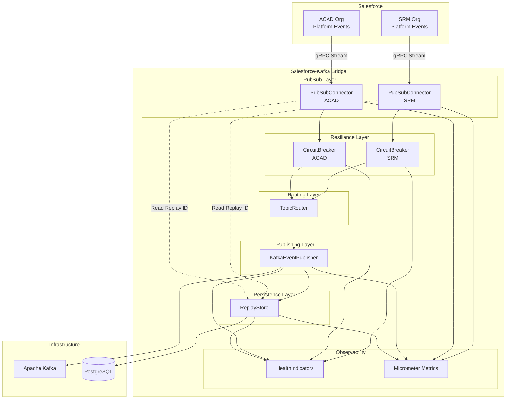
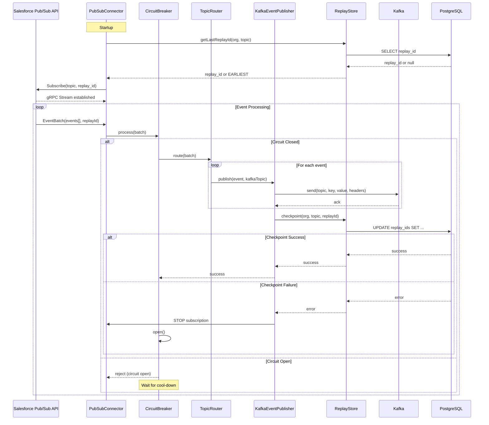
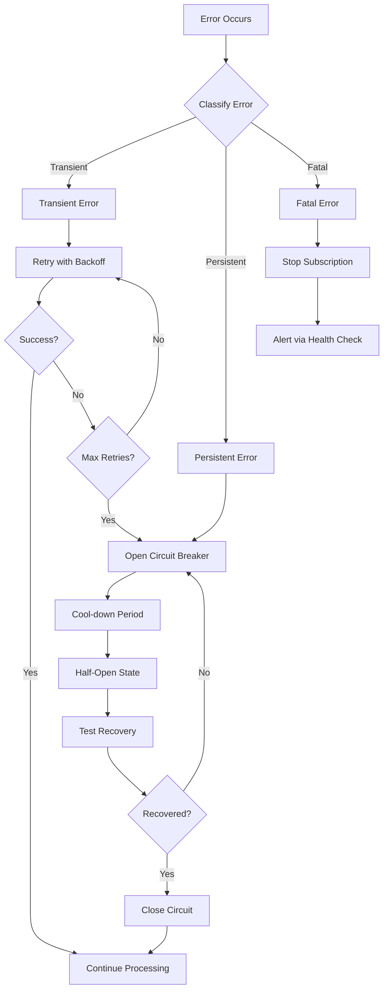
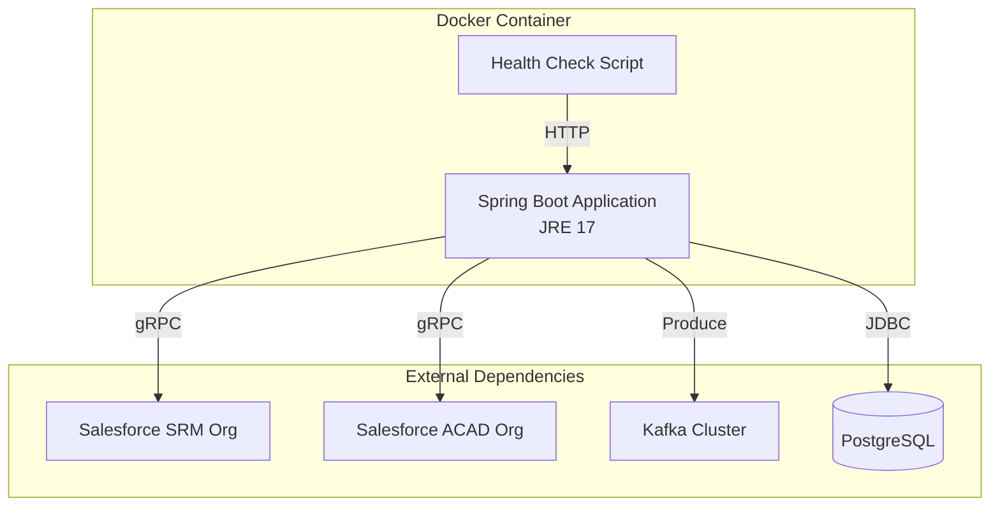

# Design Document: Salesforce-Kafka Bridge

## Overview

The Salesforce-Kafka Bridge is a standalone Spring Boot microservice that acts as a pure data pipeline between Salesforce Platform Events and Apache Kafka. The service subscribes to Salesforce events via the gRPC Pub/Sub API and publishes them to Kafka topics with exactly-once semantics. It is designed as a stateless, horizontally scalable service with persistent replay ID checkpointing in PostgreSQL.

The bridge extracts event bridging responsibility from the existing enrollment application into a dedicated microservice, supporting multiple Salesforce orgs (SRM and ACAD) with independent failure isolation, configurable topic routing, and comprehensive event loss prevention mechanisms.

Key design principles:
- No business logic processing - pure event forwarding
- Fail-fast on persistence failures to prevent event loss
- Independent failure isolation per org
- Idempotent Kafka publishing with exactly-once semantics
- Observable via Spring Boot Actuator health checks and Prometheus metrics

## Architecture

### High-Level Architecture



### Component Interaction Flow



## Components and Interfaces

### PubSubConnector

The PubSubConnector manages gRPC connections to the Salesforce Pub/Sub API and handles event stream subscriptions.

**Responsibilities:**
- Establish and maintain gRPC connections per org
- Subscribe to configured Salesforce topics with replay ID positioning
- Handle connection failures with exponential backoff
- Process incoming event batches including empty batches
- Coordinate with CircuitBreaker for failure handling

**Interface:**
```java
public interface PubSubConnector {
    /**
     * Establishes subscription for a given org and topic.
     * @param org The Salesforce org identifier (SRM, ACAD)
     * @param topic The Salesforce Platform Event topic name
     * @param replayId The replay ID to start from, or null for earliest
     * @return Subscription handle for lifecycle management
     */
    Subscription subscribe(String org, String topic, ReplayId replayId);
    
    /**
     * Stops subscription for a given org and topic.
     * Called on checkpoint failures or circuit breaker open.
     */
    void stopSubscription(String org, String topic);
    
    /**
     * Attempts to reconnect with exponential backoff.
     * @return true if reconnection successful, false otherwise
     */
    boolean reconnect(String org);
    
    /**
     * Returns current connection status for health checks.
     */
    ConnectionStatus getStatus(String org);
}
```

**Configuration:**
```yaml
salesforce:
  orgs:
    srm:
      pubsub-url: "api.pubsub.salesforce.com:7443"
      oauth-url: "https://login.salesforce.com/services/oauth2/token"
      client-id: "${SF_SRM_CLIENT_ID}"
      client-secret: "${SF_SRM_CLIENT_SECRET}"
      username: "${SF_SRM_USERNAME}"
      password: "${SF_SRM_PASSWORD}"
      topics:
        - "/event/Enrollment_Event__e"
        - "/event/Student_Event__e"
    acad:
      pubsub-url: "api.pubsub.salesforce.com:7443"
      oauth-url: "https://login.salesforce.com/services/oauth2/token"
      client-id: "${SF_ACAD_CLIENT_ID}"
      client-secret: "${SF_ACAD_CLIENT_SECRET}"
      username: "${SF_ACAD_USERNAME}"
      password: "${SF_ACAD_PASSWORD}"
      topics:
        - "/event/Course_Event__e"
  
  retry:
    max-attempts: 10
    initial-interval-ms: 1000
    max-interval-ms: 60000
    multiplier: 2.0
```

**Implementation Notes:**
- Use Salesforce Java gRPC client library
- Implement OAuth 2.0 authentication flow for each org
- Maintain separate ManagedChannel per org for connection isolation
- Handle UNAVAILABLE and DEADLINE_EXCEEDED gRPC status codes with retry
- Process empty batches to advance replay ID even when no events present

### KafkaEventPublisher

The KafkaEventPublisher publishes Salesforce events to Kafka with exactly-once semantics using idempotent producer configuration.

**Responsibilities:**
- Publish events to Kafka with idempotent producer guarantees
- Serialize event payloads as JSON byte arrays
- Add metadata headers (replay ID, org, event type, timestamp)
- Coordinate checkpoint operations with ReplayStore
- Handle Kafka publishing failures with batch-level retry

**Interface:**
```java
public interface KafkaEventPublisher {
    /**
     * Publishes a batch of events to Kafka.
     * @param batch The event batch with org, topic, and events
     * @return PublishResult indicating success or failure
     */
    PublishResult publishBatch(EventBatch batch);
    
    /**
     * Returns current Kafka connection status for health checks.
     */
    ConnectionStatus getKafkaStatus();
}

public class EventBatch {
    private String org;
    private String salesforceTopic;
    private List<PlatformEvent> events;
    private ReplayId replayId;
    private Instant receivedAt;
}

public class PlatformEvent {
    private String eventType;
    private JsonNode payload;
    private ReplayId replayId;
}

public class PublishResult {
    private boolean success;
    private int publishedCount;
    private Optional<Exception> error;
}
```

**Configuration:**
```yaml
kafka:
  bootstrap-servers: "${KAFKA_BOOTSTRAP_SERVERS}"
  producer:
    acks: all
    enable-idempotence: true
    max-in-flight-requests-per-connection: 5
    retries: 2147483647
    compression-type: snappy
    key-serializer: org.apache.kafka.common.serialization.StringSerializer
    value-serializer: org.apache.kafka.common.serialization.ByteArraySerializer
  
  security:
    protocol: "${KAFKA_SECURITY_PROTOCOL:SASL_SSL}"
    sasl-mechanism: "${KAFKA_SASL_MECHANISM:PLAIN}"
    sasl-jaas-config: "${KAFKA_SASL_JAAS_CONFIG}"
```

**Kafka Message Format:**
```
Key: <org>:<salesforce_topic>:<event_id>
Value: <JSON payload as byte[]>
Headers:
  - replay-id: <Salesforce replay ID>
  - org: <SRM|ACAD>
  - event-type: <Salesforce event type>
  - received-at: <ISO-8601 timestamp>
  - bridge-version: <application version>
```

**Implementation Notes:**
- Use Spring Kafka KafkaTemplate with transactional support
- Configure idempotent producer with `enable.idempotence=true` and `acks=all`
- Serialize payloads using Jackson ObjectMapper to byte arrays
- Use composite key format for Kafka partitioning: `{org}:{topic}:{eventId}`
- Implement synchronous send with timeout for checkpoint coordination
- On Kafka failure, return failure result without checkpointing

### ReplayStore

The ReplayStore persists replay IDs to PostgreSQL for subscription resumption after restarts.

**Responsibilities:**
- Store and retrieve replay IDs per org and topic
- Provide atomic checkpoint operations
- Support startup replay ID lookup
- Report database health status

**Interface:**
```java
public interface ReplayStore {
    /**
     * Retrieves the last checkpointed replay ID for an org and topic.
     * @return Optional containing replay ID, or empty if none exists
     */
    Optional<ReplayId> getLastReplayId(String org, String topic);
    
    /**
     * Atomically updates the replay ID for an org and topic.
     * @throws CheckpointException if database write fails
     */
    void checkpoint(String org, String topic, ReplayId replayId) throws CheckpointException;
    
    /**
     * Returns database connection status for health checks.
     */
    ConnectionStatus getDatabaseStatus();
}
```

**Database Schema:**
```sql
CREATE TABLE replay_ids (
    id BIGSERIAL PRIMARY KEY,
    org VARCHAR(50) NOT NULL,
    salesforce_topic VARCHAR(255) NOT NULL,
    replay_id BYTEA NOT NULL,
    last_updated TIMESTAMP NOT NULL DEFAULT CURRENT_TIMESTAMP,
    UNIQUE(org, salesforce_topic)
);

CREATE INDEX idx_replay_ids_org_topic ON replay_ids(org, salesforce_topic);
```

**Configuration:**
```yaml
spring:
  datasource:
    url: "${DB_URL}"
    username: "${DB_USERNAME}"
    password: "${DB_PASSWORD}"
    driver-class-name: org.postgresql.Driver
    hikari:
      maximum-pool-size: 10
      minimum-idle: 2
      connection-timeout: 30000
      idle-timeout: 600000
      max-lifetime: 1800000
  
  jpa:
    hibernate:
      ddl-auto: validate
    properties:
      hibernate:
        dialect: org.hibernate.dialect.PostgreSQLDialect
  
  flyway:
    enabled: true
    locations: classpath:db/migration
    baseline-on-migrate: true
```

**Implementation Notes:**
- Use Spring Data JPA with PostgreSQL
- Implement upsert logic using `ON CONFLICT (org, salesforce_topic) DO UPDATE`
- Store replay ID as BYTEA since it's an opaque binary value
- Use Flyway for schema migrations
- Implement fail-fast behavior: throw CheckpointException on any database error
- Add database health indicator for Spring Boot Actuator

### CircuitBreaker

The CircuitBreaker implements the circuit breaker resilience pattern to prevent cascading failures and enable automatic recovery.

**Responsibilities:**
- Track failure counts per org subscription
- Transition between closed, open, and half-open states
- Enforce cool-down periods before retry attempts
- Report circuit state for health checks and metrics

**Interface:**
```java
public interface CircuitBreaker {
    /**
     * Executes operation if circuit is closed, rejects if open.
     * @return Result of operation or circuit open exception
     */
    <T> T execute(String org, Supplier<T> operation) throws CircuitOpenException;
    
    /**
     * Records a successful operation, potentially closing the circuit.
     */
    void recordSuccess(String org);
    
    /**
     * Records a failed operation, potentially opening the circuit.
     */
    void recordFailure(String org, Exception error);
    
    /**
     * Returns current circuit state for an org.
     */
    CircuitState getState(String org);
}

public enum CircuitState {
    CLOSED,    // Normal operation
    OPEN,      // Failures exceeded threshold, rejecting calls
    HALF_OPEN  // Testing if service recovered
}
```

**Configuration:**
```yaml
resilience:
  circuit-breaker:
    failure-threshold: 5
    cool-down-period-seconds: 60
    half-open-max-attempts: 3
```

**Implementation Notes:**
- Use Resilience4j CircuitBreaker library
- Configure separate circuit breaker instance per org
- On circuit open, log ERROR with org and topic details
- Emit circuit state change metrics
- After cool-down period, transition to half-open and attempt recovery
- On successful recovery, transition back to closed state

### TopicRouter

The TopicRouter maps Salesforce Platform Event topics to Kafka topics based on configuration.

**Responsibilities:**
- Load and validate topic routing configuration at startup
- Provide topic mapping lookup per org
- Handle unmapped topics with warning logs

**Interface:**
```java
public interface TopicRouter {
    /**
     * Returns the Kafka topic for a given Salesforce topic and org.
     * @return Optional containing Kafka topic, or empty if no mapping exists
     */
    Optional<String> getKafkaTopic(String org, String salesforceTopic);
    
    /**
     * Validates all routing configuration at startup.
     * @throws ConfigurationException if any mapping is invalid
     */
    void validateConfiguration() throws ConfigurationException;
}
```

**Configuration:**
```yaml
bridge:
  topic-routing:
    srm:
      "/event/Enrollment_Event__e": "salesforce.srm.enrollment"
      "/event/Student_Event__e": "salesforce.srm.student"
    acad:
      "/event/Course_Event__e": "salesforce.acad.course"
```

**Implementation Notes:**
- Load configuration into immutable Map<String, Map<String, String>>
- Validate at startup that all orgs in routing config exist in salesforce.orgs
- Log WARNING when event received for unmapped topic
- Discard events with no mapping (do not checkpoint)
- Use @ConfigurationProperties for type-safe configuration binding

### HealthIndicators

The HealthIndicators integrate with Spring Boot Actuator to expose component health status.

**Responsibilities:**
- Aggregate health status from all components
- Report detailed health information per component
- Return HTTP 503 when any component unhealthy

**Implementation:**
```java
@Component
public class PubSubHealthIndicator implements HealthIndicator {
    @Override
    public Health health() {
        Map<String, Object> details = new HashMap<>();
        boolean allHealthy = true;
        
        for (String org : configuredOrgs) {
            ConnectionStatus status = pubSubConnector.getStatus(org);
            details.put(org, status);
            if (!status.isHealthy()) {
                allHealthy = false;
            }
        }
        
        return allHealthy 
            ? Health.up().withDetails(details).build()
            : Health.down().withDetails(details).build();
    }
}

@Component
public class KafkaHealthIndicator implements HealthIndicator {
    @Override
    public Health health() {
        ConnectionStatus status = kafkaEventPublisher.getKafkaStatus();
        return status.isHealthy()
            ? Health.up().withDetail("status", status).build()
            : Health.down().withDetail("status", status).build();
    }
}

@Component
public class CircuitBreakerHealthIndicator implements HealthIndicator {
    @Override
    public Health health() {
        Map<String, CircuitState> states = new HashMap<>();
        boolean allClosed = true;
        
        for (String org : configuredOrgs) {
            CircuitState state = circuitBreaker.getState(org);
            states.put(org, state);
            if (state != CircuitState.CLOSED) {
                allClosed = false;
            }
        }
        
        return allClosed
            ? Health.up().withDetails(states).build()
            : Health.down().withDetails(states).build();
    }
}
```

**Configuration:**
```yaml
management:
  endpoints:
    web:
      exposure:
        include: health,prometheus,info
      base-path: /actuator
  
  endpoint:
    health:
      show-details: always
      probes:
        enabled: true
  
  metrics:
    export:
      prometheus:
        enabled: true
    tags:
      application: salesforce-kafka-bridge
      environment: "${ENVIRONMENT:dev}"
```

**Metrics:**
- `bridge.events.received{org, topic}` - Counter of events received from Salesforce
- `bridge.events.published{org, topic}` - Counter of events published to Kafka
- `bridge.checkpoint.success{org, topic}` - Counter of successful checkpoints
- `bridge.checkpoint.failure{org, topic}` - Counter of failed checkpoints
- `bridge.circuit.state{org}` - Gauge of circuit breaker state (0=closed, 1=open, 2=half-open)
- `bridge.reconnect.attempts{org}` - Counter of gRPC reconnection attempts
- `bridge.batch.processing.time{org, topic}` - Timer for batch processing duration

## Data Models

### ReplayId Entity

```java
@Entity
@Table(name = "replay_ids", 
       uniqueConstraints = @UniqueConstraint(columnNames = {"org", "salesforce_topic"}))
public class ReplayIdEntity {
    @Id
    @GeneratedValue(strategy = GenerationType.IDENTITY)
    private Long id;
    
    @Column(nullable = false, length = 50)
    private String org;
    
    @Column(name = "salesforce_topic", nullable = false)
    private String salesforceTopic;
    
    @Column(name = "replay_id", nullable = false)
    private byte[] replayId;
    
    @Column(name = "last_updated", nullable = false)
    private Instant lastUpdated;
    
    @PrePersist
    @PreUpdate
    protected void onUpdate() {
        lastUpdated = Instant.now();
    }
}
```

### Configuration Models

```java
@ConfigurationProperties(prefix = "salesforce")
public class SalesforceProperties {
    private Map<String, OrgConfig> orgs;
    private RetryConfig retry;
}

public class OrgConfig {
    private String pubsubUrl;
    private String oauthUrl;
    private String clientId;
    private String clientSecret;
    private String username;
    private String password;
    private List<String> topics;
}

public class RetryConfig {
    private int maxAttempts;
    private long initialIntervalMs;
    private long maxIntervalMs;
    private double multiplier;
}

@ConfigurationProperties(prefix = "bridge")
public class BridgeProperties {
    private Map<String, Map<String, String>> topicRouting;
}

@ConfigurationProperties(prefix = "resilience.circuit-breaker")
public class CircuitBreakerProperties {
    private int failureThreshold;
    private int coolDownPeriodSeconds;
    private int halfOpenMaxAttempts;
}
```

## Error Handling

### Error Categories and Recovery Strategies



### Error Handling by Component

**PubSubConnector Errors:**

| Error Type | Cause | Recovery Strategy |
|------------|-------|-------------------|
| UNAVAILABLE | Network issue, Salesforce downtime | Exponential backoff retry up to max attempts |
| UNAUTHENTICATED | OAuth token expired | Refresh OAuth token and retry |
| DEADLINE_EXCEEDED | Timeout on gRPC call | Retry with same replay ID |
| INVALID_ARGUMENT | Invalid topic or replay ID | Log ERROR, fail startup (configuration error) |
| RESOURCE_EXHAUSTED | Rate limit exceeded | Exponential backoff with longer intervals |

**KafkaEventPublisher Errors:**

| Error Type | Cause | Recovery Strategy |
|------------|-------|-------------------|
| TimeoutException | Kafka broker unavailable | Skip checkpoint, retry batch on next cycle |
| RecordTooLargeException | Event payload exceeds max size | Log ERROR, discard event, checkpoint remaining |
| SerializationException | Invalid JSON payload | Log ERROR, discard event, checkpoint remaining |
| NotLeaderForPartitionException | Kafka rebalance in progress | Retry with backoff |

**ReplayStore Errors:**

| Error Type | Cause | Recovery Strategy |
|------------|-------|-------------------|
| SQLException | Database connection lost | Fail-fast: stop subscription, open circuit breaker |
| ConstraintViolationException | Data integrity issue | Fail-fast: stop subscription, log ERROR |
| QueryTimeoutException | Database overloaded | Fail-fast: stop subscription, open circuit breaker |

**Fail-Fast Behavior:**

When a checkpoint fails, the bridge MUST:
1. Stop the subscription for the affected org/topic within 5 seconds
2. Open the circuit breaker for that org
3. Log ERROR with full context (org, topic, replay ID, error details)
4. Report unhealthy status via health endpoint
5. NOT acknowledge the event batch to Salesforce
6. Attempt automatic recovery after cool-down period

### Logging Strategy

```yaml
logging:
  level:
    root: INFO
    com.example.bridge: DEBUG
    org.apache.kafka: WARN
    io.grpc: WARN
  
  pattern:
    console: "%d{yyyy-MM-dd HH:mm:ss} [%thread] %-5level %logger{36} - %msg%n"
  
  file:
    name: /var/log/bridge/application.log
    max-size: 100MB
    max-history: 30
```

**Log Levels:**
- ERROR: Checkpoint failures, circuit breaker opens, fatal errors
- WARN: Unmapped topics, retry attempts, circuit breaker half-open
- INFO: Startup, shutdown, subscription lifecycle, checkpoint success
- DEBUG: Event batch details, gRPC connection details

**Structured Logging Fields:**
- org: Salesforce org identifier
- topic: Salesforce topic name
- kafka_topic: Target Kafka topic
- replay_id: Current replay ID
- event_count: Number of events in batch
- error_type: Classification of error
- retry_attempt: Current retry attempt number


## Correctness Properties

A property is a characteristic or behavior that should hold true across all valid executions of a system—essentially, a formal statement about what the system should do. Properties serve as the bridge between human-readable specifications and machine-verifiable correctness guarantees.

### Property 1: Replay ID Lifecycle

For any org and topic combination, when a subscription is established, the bridge should request events starting from the last checkpointed replay ID in the Replay Store, and after a failure recovery, should resume from that same checkpointed replay ID.

**Validates: Requirements 1.2, 3.3, 4.6**

### Property 2: Active Subscription Maintenance

For any configured Salesforce topic, while the bridge is running and the circuit breaker is closed, an active subscription stream should exist.

**Validates: Requirements 1.4**

### Property 3: Exponential Backoff Retry

For any gRPC connection loss, the bridge should attempt reconnection with exponentially increasing intervals, where each interval is the previous interval multiplied by the configured multiplier, up to the maximum interval of 60 seconds.

**Validates: Requirements 1.5**

### Property 4: Circuit Breaker Opens After Max Retries

For any org, when reconnection attempts exceed the configured maximum retry count, the circuit breaker for that org should transition to the open state and the health endpoint should report the org as unhealthy.

**Validates: Requirements 1.6**

### Property 5: Event Routing

For any platform event batch received from Salesforce, each event should be published to the Kafka topic determined by the topic routing configuration for that org and Salesforce topic.

**Validates: Requirements 2.1**

### Property 6: Message Headers Completeness

For any platform event published to Kafka, the Kafka message headers should include the Salesforce replay ID, event type, org identifier, and reception timestamp.

**Validates: Requirements 2.3, 5.4**

### Property 7: Checkpoint After Successful Publish

For any event batch where all events are successfully published to Kafka, the bridge should persist the latest replay ID from that batch to the Replay Store.

**Validates: Requirements 2.4**

### Property 8: No Checkpoint On Publish Failure

For any event batch where Kafka publishing fails for any event, the bridge should not checkpoint the replay ID for that batch.

**Validates: Requirements 2.5**

### Property 9: JSON Serialization Round Trip

For any platform event payload, serializing to JSON bytes and deserializing back should produce an equivalent payload structure.

**Validates: Requirements 2.6**

### Property 10: Atomic Checkpoint Updates

For any checkpoint operation, the replay ID update in the Replay Store should be atomic—either the update completes entirely or not at all, with no partial updates visible.

**Validates: Requirements 3.2**

### Property 11: Fail-Fast On Checkpoint Failure

For any checkpoint operation that fails due to database error, the bridge should stop the subscription for the affected org and topic within 5 seconds, not acknowledge the event batch, and report the failure via the health endpoint.

**Validates: Requirements 3.4, 3.5, 4.2**

### Property 12: Circuit Breaker Recovery

For any org with an open circuit breaker, after the configured cool-down period, the bridge should attempt to re-establish the subscription.

**Validates: Requirements 4.4**

### Property 13: Circuit Breaker Observability

For any org where the circuit breaker transitions to the open state, the bridge should log an ERROR message including the org identifier and topic name, and the health endpoint should report that org as unhealthy.

**Validates: Requirements 4.3, 4.5**

### Property 14: Multi-Org Concurrency

For any configuration with N orgs, the bridge should maintain N concurrent active subscriptions with independent gRPC connections, circuit breakers, and replay store entries.

**Validates: Requirements 5.1, 5.2**

### Property 15: Org Failure Isolation

For any org that experiences a subscription failure, all other configured orgs should continue processing events without interruption.

**Validates: Requirements 5.3**

### Property 16: One-to-One Topic Mapping

For any org and Salesforce topic combination in the routing configuration, there should be exactly one corresponding Kafka topic.

**Validates: Requirements 6.2**

### Property 17: Unmapped Topic Handling

For any platform event received for a Salesforce topic with no configured Kafka mapping, the bridge should log a warning and discard the event without checkpointing.

**Validates: Requirements 6.3**

### Property 18: Health Endpoint Component Status

For any health check request, the health endpoint should report the status of all org gRPC connections, the Kafka producer connection, and the PostgreSQL database connection, and should return HTTP 503 when any component is unhealthy.

**Validates: Requirements 7.2, 7.3**

### Property 19: Metrics Emission

For any event received from Salesforce, the bridge should increment the corresponding `bridge.events.received` metric, and for any event published to Kafka, should increment the corresponding `bridge.events.published` metric.

**Validates: Requirements 7.4**

### Property 20: Environment Variable Configuration Override

For any configuration property, setting a corresponding environment variable should override the value from the application.yml file.

**Validates: Requirements 8.2, 9.2**

### Property 21: Startup Timing

For any container start under normal conditions, the health endpoint should respond to requests within 30 seconds.

**Validates: Requirements 8.5**

### Property 22: Required Configuration Validation

For any required configuration property that is missing at startup, the bridge should fail to start with a descriptive error message identifying the missing property.

**Validates: Requirements 9.3**

### Property 23: Sensitive Data Protection

For any log output or exposed endpoint, sensitive configuration values including credentials and connection strings should not appear in plain text.

**Validates: Requirements 9.4**

### Property 24: Org Subscription Toggle

For any org with its subscription disabled via configuration flag, the bridge should not establish a subscription for that org.

**Validates: Requirements 10.4**

## Testing Strategy

### Dual Testing Approach

The testing strategy employs both unit tests and property-based tests to achieve comprehensive coverage:

- **Unit tests**: Verify specific examples, edge cases, error conditions, and integration points between components
- **Property-based tests**: Verify universal properties across all inputs using randomized test data

Both approaches are complementary and necessary. Unit tests catch concrete bugs in specific scenarios, while property-based tests verify general correctness across a wide input space.

### Property-Based Testing

**Framework**: Use [jqwik](https://jqwik.net/) for Java property-based testing, which integrates with JUnit 5.

**Configuration**: Each property test should run a minimum of 100 iterations to ensure adequate randomized input coverage.

**Test Tagging**: Each property-based test must include a comment referencing the design document property:
```java
// Feature: salesforce-kafka-bridge, Property 1: Replay ID Lifecycle
@Property
void replayIdLifecycle(@ForAll("orgTopicPairs") OrgTopicPair pair) {
    // Test implementation
}
```

**Property Test Coverage**:
- Property 1-24: Each correctness property should be implemented as a property-based test
- Use jqwik generators for: org identifiers, topic names, replay IDs, event payloads, timestamps
- Use jqwik's `@ForAll` annotation for parameterized inputs
- Use jqwik's stateful testing for properties involving state transitions (circuit breaker, subscriptions)

### Unit Testing

**Framework**: JUnit 5 with Mockito for mocking, Testcontainers for PostgreSQL and Kafka integration tests.

**Unit Test Focus**:
- Startup behavior: Verify connections established for all configured orgs (Req 1.1)
- Edge case: Subscription with no persisted replay ID uses earliest (Req 1.3)
- Edge case: Empty batch checkpointing (Req 4.1)
- Configuration: Idempotent producer settings (Req 2.2)
- Configuration: Database schema validation (Req 3.1)
- Configuration: Topic routing loaded from config (Req 6.1)
- Configuration: Startup validation fails for undefined org in routing (Req 6.4)
- Endpoints: Health endpoint exists at `/actuator/health` (Req 7.1)
- Endpoints: Prometheus endpoint exists at `/actuator/prometheus` (Req 7.5)
- Logging: Startup message includes version, orgs, topics (Req 7.6)
- Docker: Dockerfile uses multi-stage build (Req 8.1)
- Docker: Container runs as non-root user (Req 8.3)
- Docker: Dockerfile includes HEALTHCHECK (Req 8.4)
- Configuration: Profile-based config overrides (Req 9.1)
- Migration: Separate consumer group and table names (Req 10.2)
- Migration: Separate Kafka topics during parallel deployment (Req 10.3)

**Integration Tests**:
- End-to-end flow: Mock Salesforce Pub/Sub API → Bridge → Real Kafka (Testcontainers) → Real PostgreSQL (Testcontainers)
- Verify replay ID persistence and retrieval across restarts
- Verify circuit breaker state transitions with simulated failures
- Verify multi-org isolation with concurrent subscriptions
- Verify fail-fast behavior on database failures

**Test Organization**:
```
src/test/java/
├── com/example/bridge/
│   ├── pubsub/
│   │   ├── PubSubConnectorTest.java          # Unit tests
│   │   └── PubSubConnectorPropertyTest.java  # Property tests
│   ├── kafka/
│   │   ├── KafkaEventPublisherTest.java
│   │   └── KafkaEventPublisherPropertyTest.java
│   ├── replay/
│   │   ├── ReplayStoreTest.java
│   │   └── ReplayStorePropertyTest.java
│   ├── resilience/
│   │   ├── CircuitBreakerTest.java
│   │   └── CircuitBreakerPropertyTest.java
│   ├── routing/
│   │   ├── TopicRouterTest.java
│   │   └── TopicRouterPropertyTest.java
│   └── integration/
│       ├── EndToEndIntegrationTest.java
│       └── MultiOrgIntegrationTest.java
```

### Test Data Generators (jqwik)

```java
@Provide
Arbitrary<String> orgIdentifiers() {
    return Arbitraries.of("SRM", "ACAD");
}

@Provide
Arbitrary<String> salesforceTopics() {
    return Arbitraries.of(
        "/event/Enrollment_Event__e",
        "/event/Student_Event__e",
        "/event/Course_Event__e"
    );
}

@Provide
Arbitrary<ReplayId> replayIds() {
    return Arbitraries.bytes()
        .array(byte[].class)
        .ofMinSize(16)
        .ofMaxSize(32)
        .map(ReplayId::new);
}

@Provide
Arbitrary<JsonNode> eventPayloads() {
    return Arbitraries.maps(
        Arbitraries.strings().alpha().ofMinLength(1).ofMaxLength(20),
        Arbitraries.oneOf(
            Arbitraries.strings(),
            Arbitraries.integers(),
            Arbitraries.doubles()
        )
    ).map(map -> new ObjectMapper().valueToTree(map));
}
```

## Deployment Architecture

### Container Architecture



### Multi-Environment Configuration

**Development Environment:**
```yaml
# application-dev.yml
salesforce:
  orgs:
    srm:
      pubsub-url: "test.salesforce.com:7443"
      topics:
        - "/event/Enrollment_Event__e"
    acad:
      enabled: false  # Disable ACAD in dev

kafka:
  bootstrap-servers: "localhost:9092"

spring:
  datasource:
    url: "jdbc:postgresql://localhost:5432/bridge_dev"

bridge:
  topic-routing:
    srm:
      "/event/Enrollment_Event__e": "salesforce.dev.srm.enrollment"
```

**Staging Environment:**
```yaml
# application-staging.yml
salesforce:
  orgs:
    srm:
      pubsub-url: "test.salesforce.com:7443"
      topics:
        - "/event/Enrollment_Event__e"
        - "/event/Student_Event__e"
    acad:
      pubsub-url: "test.salesforce.com:7443"
      topics:
        - "/event/Course_Event__e"

kafka:
  bootstrap-servers: "${KAFKA_BOOTSTRAP_SERVERS}"

spring:
  datasource:
    url: "${DB_URL}"

bridge:
  topic-routing:
    srm:
      "/event/Enrollment_Event__e": "salesforce.staging.srm.enrollment"
      "/event/Student_Event__e": "salesforce.staging.srm.student"
    acad:
      "/event/Course_Event__e": "salesforce.staging.acad.course"
```

**Production Environment:**
```yaml
# application-prod.yml
salesforce:
  orgs:
    srm:
      pubsub-url: "api.pubsub.salesforce.com:7443"
      topics:
        - "/event/Enrollment_Event__e"
        - "/event/Student_Event__e"
    acad:
      pubsub-url: "api.pubsub.salesforce.com:7443"
      topics:
        - "/event/Course_Event__e"

kafka:
  bootstrap-servers: "${KAFKA_BOOTSTRAP_SERVERS}"
  security:
    protocol: "SASL_SSL"
    sasl-mechanism: "PLAIN"

spring:
  datasource:
    url: "${DB_URL}"
    hikari:
      maximum-pool-size: 20

bridge:
  topic-routing:
    srm:
      "/event/Enrollment_Event__e": "salesforce.srm.enrollment"
      "/event/Student_Event__e": "salesforce.srm.student"
    acad:
      "/event/Course_Event__e": "salesforce.acad.course"

resilience:
  circuit-breaker:
    failure-threshold: 10
    cool-down-period-seconds: 120
```

### Dockerfile

```dockerfile
# Multi-stage build for minimal image size
FROM maven:3.9-eclipse-temurin-17 AS build

WORKDIR /app

# Copy dependency definitions
COPY pom.xml .
RUN mvn dependency:go-offline

# Copy source and build
COPY src ./src
RUN mvn clean package -DskipTests

# Runtime stage
FROM eclipse-temurin:17-jre-alpine

# Create non-root user
RUN addgroup -S bridge && adduser -S bridge -G bridge

WORKDIR /app

# Copy artifact from build stage
COPY --from=build /app/target/salesforce-kafka-bridge-*.jar app.jar

# Change ownership
RUN chown -R bridge:bridge /app

# Switch to non-root user
USER bridge

# Expose actuator port
EXPOSE 8080

# Health check
HEALTHCHECK --interval=30s --timeout=5s --start-period=30s --retries=3 \
  CMD wget --no-verbose --tries=1 --spider http://localhost:8080/actuator/health || exit 1

# Run application
ENTRYPOINT ["java", "-jar", "app.jar"]
```

### Docker Compose (Local Development)

```yaml
version: '3.8'

services:
  postgres:
    image: postgres:15-alpine
    environment:
      POSTGRES_DB: bridge_dev
      POSTGRES_USER: bridge
      POSTGRES_PASSWORD: bridge_dev_pass
    ports:
      - "5432:5432"
    volumes:
      - postgres_data:/var/lib/postgresql/data

  kafka:
    image: confluentinc/cp-kafka:7.5.0
    environment:
      KAFKA_BROKER_ID: 1
      KAFKA_ZOOKEEPER_CONNECT: zookeeper:2181
      KAFKA_ADVERTISED_LISTENERS: PLAINTEXT://localhost:9092
      KAFKA_OFFSETS_TOPIC_REPLICATION_FACTOR: 1
    ports:
      - "9092:9092"
    depends_on:
      - zookeeper

  zookeeper:
    image: confluentinc/cp-zookeeper:7.5.0
    environment:
      ZOOKEEPER_CLIENT_PORT: 2181
    ports:
      - "2181:2181"

  bridge:
    build: .
    environment:
      SPRING_PROFILES_ACTIVE: dev
      DB_URL: jdbc:postgresql://postgres:5432/bridge_dev
      DB_USERNAME: bridge
      DB_PASSWORD: bridge_dev_pass
      KAFKA_BOOTSTRAP_SERVERS: kafka:9092
      SF_SRM_CLIENT_ID: ${SF_SRM_CLIENT_ID}
      SF_SRM_CLIENT_SECRET: ${SF_SRM_CLIENT_SECRET}
      SF_SRM_USERNAME: ${SF_SRM_USERNAME}
      SF_SRM_PASSWORD: ${SF_SRM_PASSWORD}
    ports:
      - "8080:8080"
    depends_on:
      - postgres
      - kafka
    healthcheck:
      test: ["CMD", "wget", "--no-verbose", "--tries=1", "--spider", "http://localhost:8080/actuator/health"]
      interval: 30s
      timeout: 5s
      retries: 3
      start_period: 30s

volumes:
  postgres_data:
```

## Migration Strategy

### Phase 1: Parallel Deployment (Week 1-2)

**Objective**: Deploy bridge alongside enrollment application without disrupting existing flow.

**Steps**:
1. Deploy bridge with ACAD org disabled, SRM org enabled
2. Configure bridge to publish to separate Kafka topics: `salesforce.migration.srm.*`
3. Deploy shadow consumers that read from migration topics but don't process
4. Monitor for 1 week:
   - Compare event counts between enrollment app and bridge
   - Verify replay ID checkpointing works correctly
   - Verify no events lost during bridge restarts
   - Monitor circuit breaker behavior

**Configuration**:
```yaml
# Bridge configuration during Phase 1
salesforce:
  orgs:
    srm:
      enabled: true
      topics:
        - "/event/Enrollment_Event__e"
        - "/event/Student_Event__e"
    acad:
      enabled: false  # Keep disabled

bridge:
  topic-routing:
    srm:
      "/event/Enrollment_Event__e": "salesforce.migration.srm.enrollment"
      "/event/Student_Event__e": "salesforce.migration.srm.student"
```

**Rollback Plan**: Stop bridge container, no impact to enrollment application.

### Phase 2: SRM Cutover (Week 3)

**Objective**: Switch SRM org from enrollment app to bridge.

**Steps**:
1. Update bridge configuration to publish to production topics
2. Deploy updated bridge
3. Disable SRM subscription in enrollment application
4. Monitor for 48 hours:
   - Verify downstream consumers receive events
   - Verify event processing latency unchanged
   - Monitor error rates and circuit breaker

**Configuration**:
```yaml
# Bridge configuration during Phase 2
salesforce:
  orgs:
    srm:
      enabled: true
      topics:
        - "/event/Enrollment_Event__e"
        - "/event/Student_Event__e"
    acad:
      enabled: false

bridge:
  topic-routing:
    srm:
      "/event/Enrollment_Event__e": "salesforce.srm.enrollment"  # Production topic
      "/event/Student_Event__e": "salesforce.srm.student"        # Production topic
```

**Rollback Plan**: 
1. Re-enable SRM subscription in enrollment application
2. Stop bridge container
3. Enrollment app resumes from its last checkpoint

### Phase 3: ACAD Migration (Week 4)

**Objective**: Enable ACAD org in bridge.

**Steps**:
1. Enable ACAD org in bridge configuration
2. Configure ACAD topic routing
3. Deploy updated bridge
4. Disable ACAD subscription in enrollment application
5. Monitor for 48 hours

**Configuration**:
```yaml
# Bridge configuration during Phase 3
salesforce:
  orgs:
    srm:
      enabled: true
      topics:
        - "/event/Enrollment_Event__e"
        - "/event/Student_Event__e"
    acad:
      enabled: true  # Now enabled
      topics:
        - "/event/Course_Event__e"

bridge:
  topic-routing:
    srm:
      "/event/Enrollment_Event__e": "salesforce.srm.enrollment"
      "/event/Student_Event__e": "salesforce.srm.student"
    acad:
      "/event/Course_Event__e": "salesforce.acad.course"
```

**Rollback Plan**: 
1. Disable ACAD in bridge: `salesforce.orgs.acad.enabled: false`
2. Re-enable ACAD subscription in enrollment application

### Phase 4: Decommission (Week 5)

**Objective**: Remove Pub/Sub subscription code from enrollment application.

**Steps**:
1. Verify bridge has been stable for 1 week
2. Remove Pub/Sub dependencies from enrollment application
3. Remove Pub/Sub configuration from enrollment application
4. Deploy updated enrollment application
5. Drop old replay ID table from enrollment database

### Migration Validation Checklist

- [ ] Bridge publishes to correct Kafka topics per environment
- [ ] Bridge uses separate PostgreSQL table: `replay_ids` (enrollment uses `pubsub_replay_ids`)
- [ ] Bridge uses separate Kafka consumer group (not applicable - bridge is producer only)
- [ ] Event counts match between enrollment app and bridge during parallel deployment
- [ ] No duplicate events observed in downstream consumers
- [ ] Replay ID checkpointing works correctly across bridge restarts
- [ ] Circuit breaker opens and recovers correctly during simulated failures
- [ ] Health checks report accurate status
- [ ] Metrics are scraped by Dynatrace
- [ ] Logs are shipped to centralized logging system
- [ ] Alerts configured for circuit breaker open, checkpoint failures, connection failures

### Monitoring During Migration

**Key Metrics**:
- `bridge.events.received{org, topic}` - Should match enrollment app event counts
- `bridge.events.published{org, topic}` - Should equal events received
- `bridge.checkpoint.failure{org, topic}` - Should be zero
- `bridge.circuit.state{org}` - Should be 0 (closed)

**Alerts**:
- Circuit breaker open for > 5 minutes
- Checkpoint failure rate > 0
- Event publish failure rate > 1%
- Health check failing for > 2 minutes
- Event count discrepancy > 5% between enrollment app and bridge

**Dashboards**:
- Event throughput per org and topic
- End-to-end latency (Salesforce → Kafka)
- Circuit breaker state timeline
- Checkpoint success/failure rates
- gRPC connection status
- Database connection pool metrics

